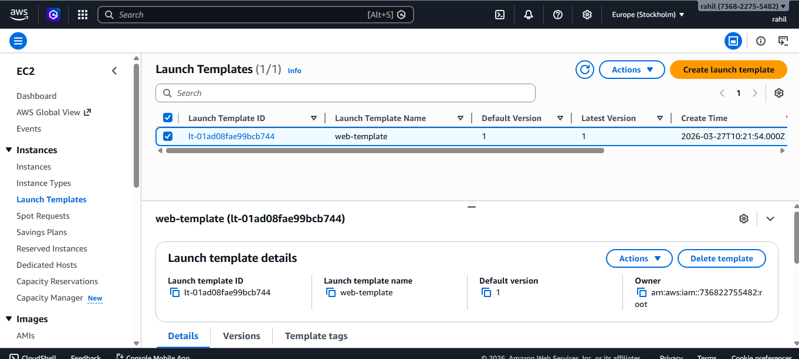
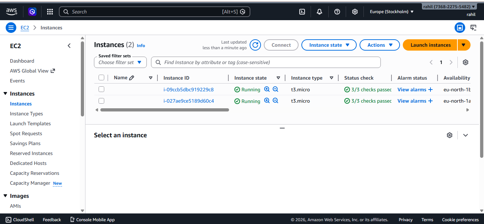
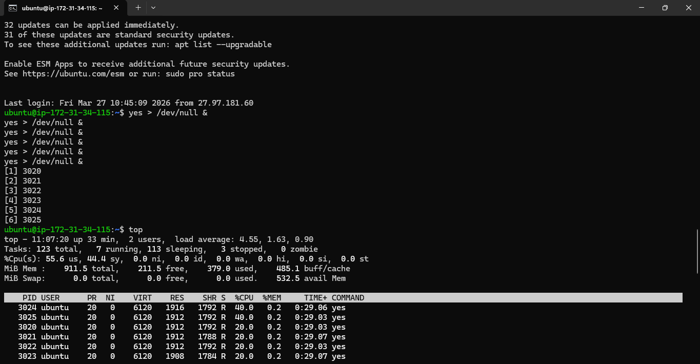
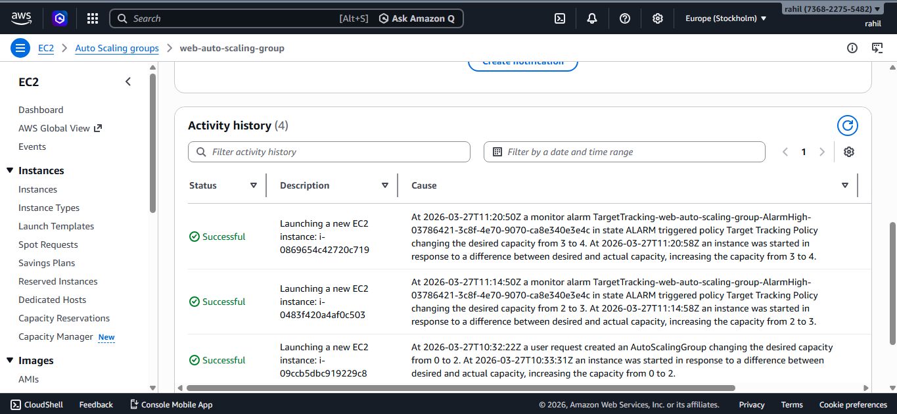
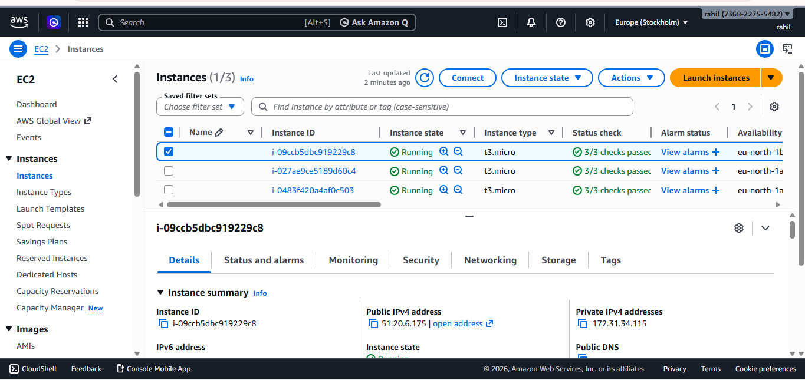

# aws-auto-scaling-project
AWS Auto Scaling Architecture using EC2 and Application Load Balancer
# AWS Auto Scaling Architecture Project

This project demonstrates how to build a scalable web infrastructure using AWS services.

## Services Used
- Amazon EC2
- Application Load Balancer
- Auto Scaling Group
- CloudWatch

## Project Steps
1. Created a launch template to define EC2 configuration.
2. Configured an Auto Scaling Group with desired, minimum, and maximum capacity.
3. Integrated the Auto Scaling Group with an Application Load Balancer.
4. Implemented a target tracking scaling policy based on CPU utilization.
5. Performed CPU stress testing to trigger automatic scaling.

## Result
The system automatically launches new EC2 instances when CPU utilization increases, ensuring high availability and scalability.
## Project Screenshots

### Launch Template

### Auto Scaling Group

### Instances Before Scaling

### CPU Stress Test

### Auto Scaling Activity

### Instances After Scaling

